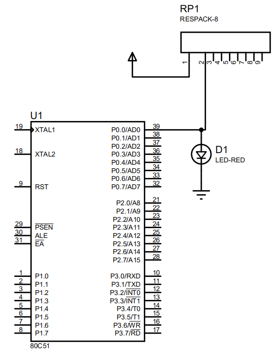
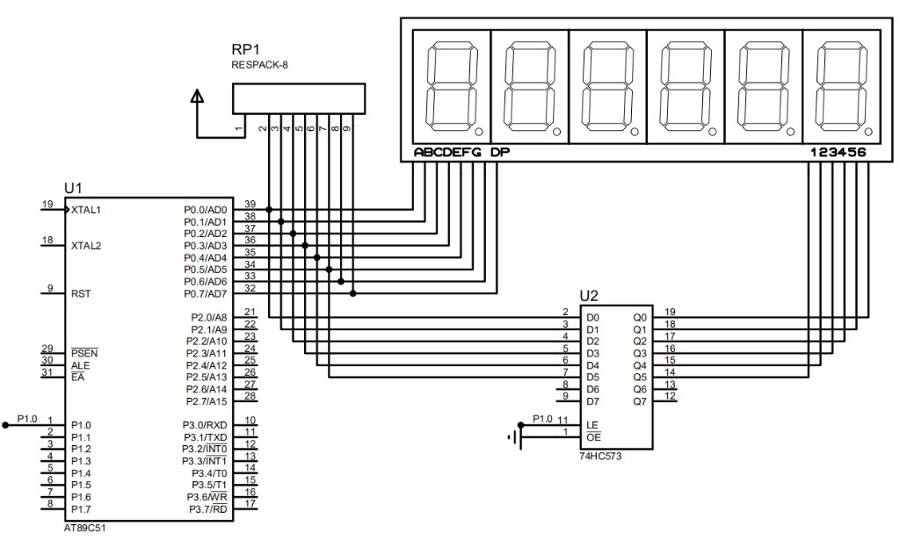
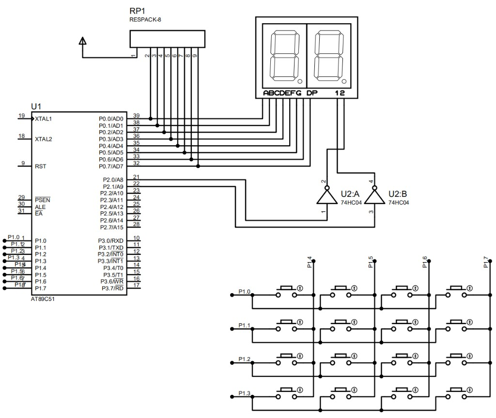
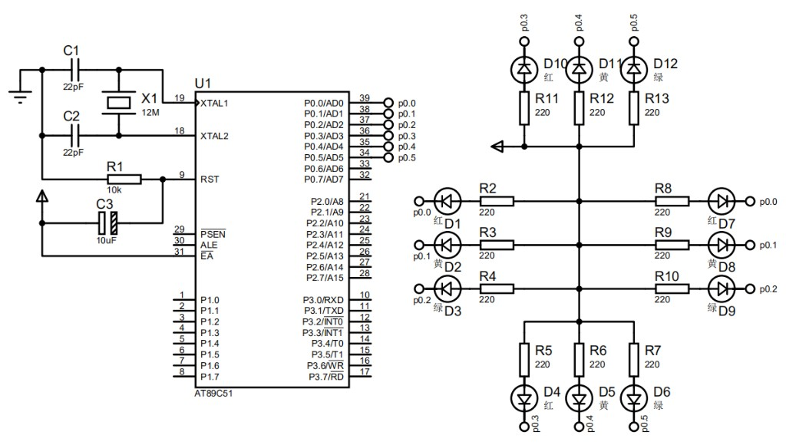

# 8051 电路原理图试题集

> 依据《8051 单片机电路原理图说明》编制。  
> 四张原理图 × 四种题型 = **16 题/套**，套题 A + 套题 B 共 **32 题**。  
> **命题规则：** 每题含 **（1）（2）两问**；代码填空题 **至少 5 个空**。

| 图号 | 电路名称 | 图片文件 |
| :--- | :--- | :--- |
| 图1 | 80C51 LED 闪烁 | `img/image-f00f0932-2ad6-47c0-9fa8-1358803a1df3.png` |
| 图2 | 六位七段数码管 + 74HC573 | `img/image-5a5bf199-4d1e-470f-8c25-8817daf370fa.png` |
| 图3 | 两位数码管 + 4×4 键盘 | `img/image-25b37314-a825-472f-b090-7cacbffb1d67.png` |
| 图4 | 四向交通灯控制 | `img/image-9cd32730-661f-472f-824c-c9f75c027119.png` |

---

# 套题 A（基准题）

---

## 图1：80C51 LED 闪烁电路



### A1-1 问答题（CKT-A101）

**（1）** 排阻 RP1 在本电路中的作用是什么？RP1 第 1 脚和第 2 脚分别接何处？

**（2）** P0 口作为通用 I/O 输出时为何必须外接上拉电阻？它与 P1 口在这方面有何区别？

**参考答案：**

（1）RP1 为 P0 口提供上拉电阻；第 1 脚接 VCC，第 2 脚接 P0.0（与 LED 阳极共接）。

（2）P0 为开漏输出，无内部上拉，写 1 时呈高阻态，需外部上拉才能输出高电平驱动 LED；P1 为准双向口，内部有上拉，可直接输出高电平。

---

### A1-2 分析题（CKT-A102）

**（1）** P0.0 分别输出高电平（1）和低电平（0）时，LED D1 的亮灭状态及电流流向。

**（2）** 若程序以约 1 Hz 频率交替输出 1 和 0，LED 呈现什么现象？从硬件角度说明为何写 0 时 LED 会熄灭。

**参考答案：**

（1）P0.0=1：引脚高阻，RP1 上拉为高，电流 VCC→RP1→LED→GND，LED 亮。P0.0=0：引脚拉低，LED 无足够正向电压，LED 灭。

（2）LED 约 1 Hz 闪烁。写 0 时 P0.0 内部导通到地，引脚接近 0 V，LED 两端压降不足以导通，电流经 P0.0 到地而非经 LED。

---

### A1-3 代码填空题（CKT-A103）— 5 空

```c
#include <______>
sbit LED = ______;

void main(void) {
    while(______) {
        LED = ______;
        delay_ms(500);
        LED = ______;
        delay_ms(500);
    }
}
```

**参考答案：** `reg51.h`　`P0^0`　`1`　`1`　`0`

---

### A1-4 程序设计题（CKT-A104）

**（1）** 定义控制 LED 的位变量，写出 `#include`、`sbit` 定义及 `void delay_ms(unsigned int ms)` 声明。

**（2）** 编写 `main` 函数，实现 LED 以 2 Hz 频率闪烁（亮 250 ms、灭 250 ms），写出完整 `while` 循环体。

**参考答案：**

（1）`#include <reg51.h>`　`sbit LED = P0^0;`　`void delay_ms(unsigned int ms);`

（2）`while (1) { LED = 1; delay_ms(250); LED = 0; delay_ms(250); }`

---

## 图2：六位七段数码管 + 74HC573



### A2-1 问答题（CKT-A201）

**（1）** 74HC573（U2）在本电路中的作用是什么？OE 引脚接 GND 表示什么？

**（2）** P1.0 与 LE 引脚如何配合完成位选锁存？LE=1 和 LE 由高变低时各发生什么？

**参考答案：**

（1）74HC573 锁存 P2 输出的位选数据；OE 接 GND 表示输出始终使能。

（2）P1.0 接 LE；LE=1 时 Q 跟随 D（透明）；LE 1→0 时锁存 D0~D5 到 Q0~Q5，驱动数码管第 1~6 位。

---

### A2-2 分析题（CKT-A202）

**（1）** 简述六位数码管动态扫描显示的工作过程（从段码输出到位选锁存再到切换下一位）。

**（2）** 为何扫描频率应高于 60 Hz？为何必须先写段码再锁存位选？若顺序颠倒会出现什么现象？

**参考答案：**

（1）循环 i=0~5：P0 写段码→P2 写位选→P1.0 产生 LE 锁存脉冲→短延时→切换下一位。

（2）>60 Hz 利用视觉暂留避免闪烁；先段码后位选防止新位选有效时段码仍为旧值，否则出现鬼影/错显。

---

### A2-3 代码填空题（CKT-A203）— 5 空

```c
P0 = ______[buf[i]];     /* 送段码 */
P2 = ______(1 << i);     /* 仅选中第 i 位 */
P1_0 = ______;           /* LE 置高 */
P1_0 = ______;           /* LE 置低，锁存 */
delay_ms(______);         /* 每位延时 2 ms */
```

**参考答案：** `seg`　`~`　`1`　`0`　`2`

---

### A2-4 程序设计题（CKT-A204）

**（1）** 定义共阴段码表 `seg[]`（0~9）及 6 字节显示缓冲区 `buf[]`（初值 0~5）。

**（2）** 编写 `scan_display()`：循环 6 位，完成段码、P2 位选、P1.0 锁存脉冲及 `delay_ms(2)`。

**参考答案：** 见 JSON 题库 CKT-A204 完整代码框架。

---

## 图3：两位数码管 + 4×4 矩阵键盘



### A3-1 问答题（CKT-A301）

**（1）** P0、P2、P1 口分别承担什么功能？P0.3 对应数码管哪一段？

**（2）** 74HC04 在位选电路中起什么作用？P2.0=1 时第 1 位数码管处于选中还是关闭状态？

**参考答案：**

（1）P0 输出段码；P2.0/P2.1 位选；P1.0~P1.3 键盘行，P1.4~P1.7 列。P0.3 对应 D 段。

（2）74HC04 反相位选；P2.0=1 经反相输出 0，第 1 位被选中。

---

### A3-2 分析题（CKT-A302）

**（1）** 分析 4×4 矩阵键盘扫描识别原理（行输出、列输入），说明如何由行列确定键值。

**（2）** 机械按键为何需要消抖？P2.0=1、P2.1=0 时，两位数码管各处于什么状态？段码显示在哪一位？

**参考答案：**

（1）逐行置 0 读列，某列为 0 则 (row,col) 确定键值。

（2）消抖消除 5~10 ms 抖动；P2.0=1 选第 1 位，P2.1=0 关第 2 位，段码仅在第 1 位显示。

---

### A3-3 代码填空题（CKT-A303）— 6 空

```c
for (row = ______; row < 4; row++) {
    P1 = (~(______ << row)) & ______ | 0xF0;
    if ((P1 & ______) != 0xF0) return row * 4 + col_index;
}
P0 = seg[tens];  P2 = ______;   /* 选十位 */
P0 = seg[ones];  P2 = ______;   /* 选个位 */
```

**参考答案：** `0`　`0x01`　`0x0F`　`0xF0`　`0x01`　`0x02`

---

### A3-4 程序设计题（CKT-A304）

**（1）** 编写 `key_scan()` 函数框架：4 行扫描，有键返回 0~15，无键返回 0xFF。

**（2）** 编写 `main` 主循环：读键更新 tens/ones，含 `delay_ms(10)` 消抖及 `scan_2digit()` 调用。

**参考答案：** 见 JSON 题库 CKT-A304。

---

## 图4：四向交通灯控制



### A4-1 问答题（CKT-A401）

**（1）** 12 MHz 晶振电路和复位电路各有什么作用？

**（2）** EA 引脚为何接 VCC？P0.6、P0.7 在本图中是否接入负载？

**参考答案：**

（1）晶振提供时钟，电容稳定振荡；复位电路上电使 RST 高电平脉冲。

（2）EA 接 VCC 从内部 Flash 取指；P0.6、P0.7 未接负载。

---

### A4-2 分析题（CKT-A402）

**（1）** 列出 P0.0~P0.5 与方向、灯色对应关系，并写出“东西绿、南北红”时 P0 十六进制值。

**（2）** 同一方向红黄绿为何不能同时亮？软件为何推荐先写 P0=0x00 再按位置 1？

**参考答案：**

（1）P0.0 东西红，P0.1 东西黄，P0.2 东西绿，P0.3 南北红，P0.4 南北黄，P0.5 南北绿；P0=**0x0C**。

（2）违反交通逻辑且可能过载；先清零避免上次状态残留导致多灯误亮。

---

### A4-3 代码填空题（CKT-A403）— 6 空

```c
sbit EW_R = ______;
sbit EW_G = ______;
sbit NS_R = ______;

P0 = ______;              /* 先全灭 */
EW_G = 1; NS_R = 1;       /* 东西绿、南北红 → P0=______ */

P0 = 0x00;
EW_R = 1; NS_G = 1;       /* 南北绿、东西红 → P0=______ */
```

**参考答案：** `P0^0`　`P0^2`　`P0^3`　`0x00`　`0x0C`　`0x21`

---

### A4-4 程序设计题（CKT-A404）

**（1）** 定义状态枚举及 `light_state()`，用 switch 写 P0（0x0C、0x0A、0x09、0x21、0x11）。

**（2）** 编写 main 状态循环：东西绿 30 s、东西黄 3 s、全红 2 s 后切换。

**参考答案：** 见 JSON 题库 CKT-A404。

---

# 套题 B（变式题）

---

## 图1 变式


### B1-1 问答题（CKT-B101）

**（1）** LED D1 阳极、阴极接何处？控制引脚管脚号及端口位名？

**（2）** RP1 第 3~9 脚接 P0 哪些位？对 P0.1~P0.7 起什么作用？

**参考答案：** （1）阳极接 P0.0（39 脚）与 RP1 节点，阴极 GND，位名 P0^0。（2）接 P0.1~P0.7 为上拉。

---

### B1-2 分析题（CKT-B102）

**（1）** 去掉 RP1 后，P0.0 输出 1 和 0 时 LED 表现及根本原因。

**（2）** LED 阴极改接 VCC、阳极经 RP1 接 P0.0，要点亮应写 1 还是 0？说明理由。

**参考答案：** （1）写 1 不亮或极暗，P0 开漏无上拉。（2）应写 0，灌电流点亮。

---

### B1-3 代码填空题（CKT-B103）— 5 空

```c
#include <______>
void main(void) {
    while(______) {
        P0 = P0 ______ 0x01;
        delay_ms(100);
        P0 = P0 ______ 0xFE;
        delay_ms(______);
    }
}
```

**参考答案：** `reg51.h`　`1`　`|`　`&`　`900`

---

### B1-4 程序设计题（CKT-B104）

**（1）** 编写 `delay_1ms()`（内层 for 约 250 次）。

**（2）** 编写 main：短亮 100 ms、长灭 900 ms，用 `P0|=0x01` / `P0&=0xFE`。

**参考答案：** 见 JSON 题库 CKT-B104。

---

## 图2 变式


### B2-1 问答题（CKT-B201）

**（1）** P0 与 P2 各传送什么数据？P0.6 对应哪一段？

**（2）** P2.0~P2.5 与 74HC573 如何连接？Q6、Q7 是否使用？

**参考答案：** （1）P0 段码，P2 位选，P0.6→G 段。（2）D0~D5/Q0~Q5，Q6/Q7 未用。

---

### B2-2 分析题（CKT-B202）

**（1）** 先锁存位选再写段码会出现什么异常？

**（2）** 每位 2 ms 时扫描频率是否满足 >60 Hz？改为 5 ms 呢？

**参考答案：** （1）鬼影/错显。（2）2 ms→83 Hz 满足；5 ms→33 Hz 不满足。

---

### B2-3 代码填空题（CKT-B203）— 5 空

```c
unsigned char code seg8 = ______;
unsigned char sel  = ______(1 << 2);
P0 = ______;
P2 = sel;
P1_0 = ______;
P1_0 = ______;
```

**参考答案：** `0x7F`　`~`　`seg8`　`1`　`0`

---

### B2-4 程序设计题（CKT-B204）

**（1）** 刷新率 ≥100 Hz 时每位最长延时多少 ms？写出公式。

**（2）** 编写 `scan_display()` 中 for 循环体（含 buf[] 学号显示）。

**参考答案：** （1）≤10/6≈1.67 ms，取 1 ms。（2）见 JSON CKT-B204。

---

## 图3 变式


### B3-1 问答题（CKT-B301）

**（1）** P1.0 与 P1.4 交叉点对应哪一键？最多几键？

**（2）** RP1 作用？P0 不接 RP1 对显示有何影响？

**参考答案：** （1）第 1 行第 1 列，16 键。（2）P0 上拉；无上拉段码高 bit 无法点亮。

---

### B3-2 分析题（CKT-B302）

**（1）** 去掉 74HC04 后位选逻辑如何变？软件如何改？

**（2）** 不消抖会有什么问题？两种消抖方法？

**参考答案：** （1）P2.x=0 选中，位选码取反。（2）一次按下多次识别；软件延时、硬件 RC。

---

### B3-3 代码填空题（CKT-B303）— 5 空

```c
unsigned char cnt = ______, pk = 0xFF, k;
if (k == ______ && pk == 0xFF) {
    cnt = (cnt + ______) % 100;
}
if (k == ______) pk = 0xFF;
scan_2digit(cnt/______, cnt%10);
```

**参考答案：** `0`　`1`　`1`　`0xFF`　`10`

---

### B3-4 程序设计题（CKT-B304）

**（1）** 编写 `scan_2digit(tens, ones)`（P2=0x01/0x02）。

**（2）** 编写 main 边沿检测：键值 1 时 cnt 加 1，0~99 循环。

**参考答案：** 见 JSON CKT-B304。

---

## 图4 变式


### B4-1 问答题（CKT-B401）

**（1）** P0.0 同时驱动 D1、D7 有何意义？

**（2）** 220 Ω 电阻作用？不串联有何后果？

**参考答案：** （1）东西红灯同步，节省 I/O。（2）限流；可能烧毁 LED 或端口。

---

### B4-2 分析题（CKT-B402）

**（1）** “全红 2 s”过渡的必要性；省略有何风险？

**（2）** “东西黄+南北红”和“全红”时 P0 值及各为 1 的位。

**参考答案：** （1）清场防绿-绿冲突。（2）0x0A（P0.1、P0.3）；0x09（P0.0、P0.3）。

---

### B4-3 代码填空题（CKT-B403）— 6 空

```c
sbit EW_R = P0^0;
sbit EW_Y = ______;
sbit NS_R = ______;
sbit NS_Y = ______;
void all_red(void) {
    P0 = ______;
    EW_R = ______; NS_R = ______;
}
```

**参考答案：** `P0^1`　`P0^3`　`P0^4`　`0x00`　`1`　`1`

---

### B4-4 程序设计题（CKT-B404）

**（1）** 写出 T0 方式 1 初始化（12 MHz，初值 3CB0H，50 ms 溢出）。

**（2）** 写出 T0 中断服务程序：20 次=1 s，main 中如何切换交通灯状态。

**参考答案：** 见 JSON CKT-B404。

---

# 命题规则摘要

| 题型 | 小问数量 | 代码填空空数 |
| :--- | :--- | :--- |
| 问答题 | 2 问 | — |
| 分析题 | 2 问 | — |
| 代码填空题 | — | ≥5 空 |
| 程序设计题 | 2 问 | — |

JSON 题库：`8051电路原理图题库.json`（与本文档同步，含完整程序参考答案）。
